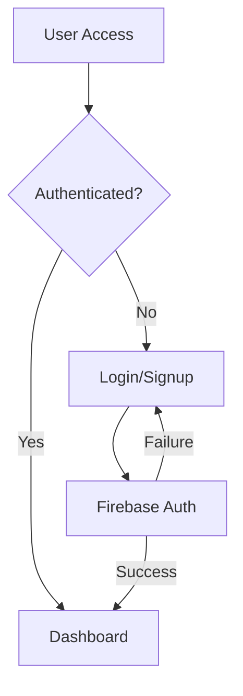
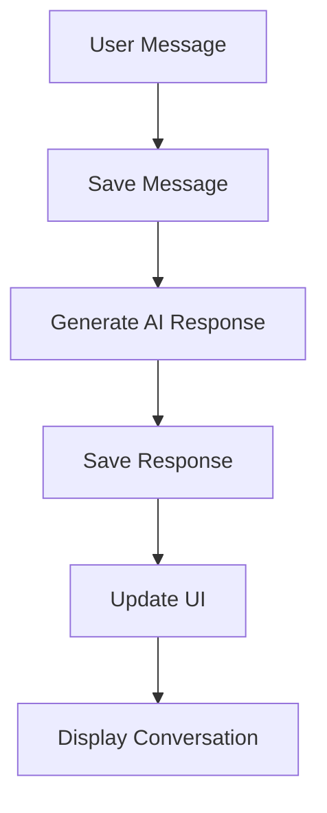
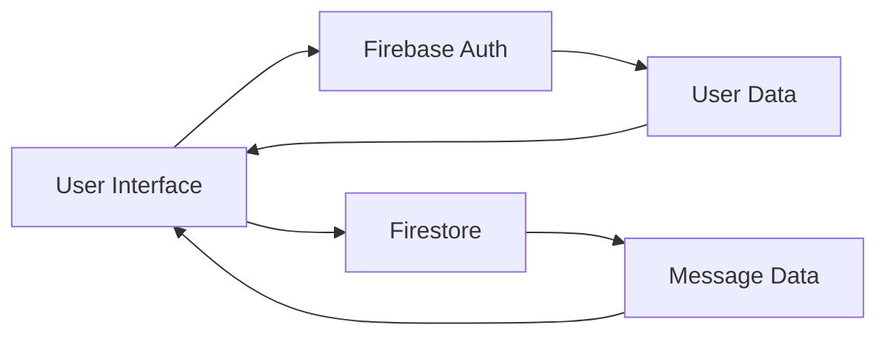

# NIYA Coach Application - Technical Documentation

## 1. Application Overview
NIYA Coach is a web application designed to provide coaching and support for burnout recovery. The application features real-time chat functionality with an AI coach, user authentication, and conversation history management.

## 2. System Architecture

### 2.1 Technology Stack
- Frontend: React with TypeScript
- UI Framework: Material-UI (MUI)
- Authentication: Firebase Authentication
- Database: Firebase Firestore
- Routing: React Router
- State Management: React Context API

### 2.2 Core Components
1. **Authentication System**
   - Firebase Authentication integration
   - Email/password authentication
   - Protected routes
   - Session management

2. **Chat System**
   - Real-time message storage
   - Conversation history
   - AI response integration
   - Message threading

3. **User Interface**
   - Responsive design
   - Material-UI components
   - Real-time updates
   - Intuitive navigation

## 3. Detailed Functionality Flow

### 3.1 Authentication Flow

1. **User Authentication Process**
   - User attempts to access protected route
   - System checks authentication status
   - If not authenticated, redirects to login
   - After successful login, redirects to dashboard

2. **Authentication Components**
   - `AuthContext`: Manages authentication state
   - `Login`: Handles user login
   - `Signup`: Handles user registration
   - `PrivateRoute`: Protects authenticated routes

### 3.2 Chat System Flow

1. **Message Processing**
   - User sends message
   - Message saved to Firestore
   - AI generates response
   - Response saved to Firestore
   - UI updates with new messages

2. **Conversation Management**
   - Messages stored in Firestore
   - Real-time updates
   - Conversation history retrieval
   - Message threading

### 3.3 Data Flow

1. **Data Storage**
   - User authentication data in Firebase Auth
   - Conversation data in Firestore
   - Real-time synchronization
   - Data persistence

## 4. Component Details

### 4.1 Authentication Components
1. **AuthContext**
   - Manages authentication state
   - Provides authentication methods
   - Handles user session
   - Exposes authentication hooks

2. **Login/Signup**
   - Form validation
   - Error handling
   - Firebase integration
   - User feedback

### 4.2 Chat Components
1. **Dashboard**
   - Message display
   - Input handling
   - Conversation management
   - Real-time updates

2. **Chat Service**
   - Message storage
   - Conversation retrieval
   - Error handling
   - Data synchronization

## 5. Security Implementation

### 5.1 Authentication Security
- Firebase Authentication
- Protected routes
- Session management
- Secure token handling

### 5.2 Data Security
- Firestore security rules
- Data validation
- Input sanitization
- Error handling

## 6. Error Handling

### 6.1 Authentication Errors
- Invalid credentials
- Network issues
- Session expiration
- Account creation failures

### 6.2 Chat System Errors
- Message sending failures
- Network connectivity
- Data synchronization
- AI response generation

## 7. Performance Considerations

### 7.1 Optimization Techniques
- Lazy loading
- Data caching
- Real-time updates
- Efficient rendering

### 7.2 Scalability
- Firebase scalability
- Data structure optimization
- Load balancing
- Resource management 